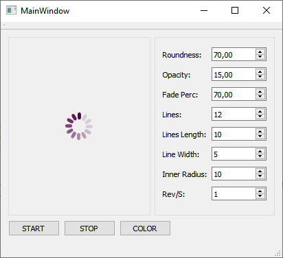

# WaitingSpinner

WaitingSpinner — это настраиваемый виджет Qt с широкими возможностями настройки для отображения значков «ожидания» или «загрузки» в приложениях Qt.


<p align="center"></p>

## Конфигурация

Всеми следующими свойствами можно управлять напрямую через соответствующие установщики:

- Цвет виджета
- «Округлость» линий
- Скорость (обороты в секунду)
- Количество линий, которые необходимо нарисовать
- Длина линии
- Ширина линии
- Радиус «мертвого пространства» или внутреннего круга спиннера
- Процент затухания "шлейфа"
- Минимальная непрозрачность «следа»

## Пример использования:

```c++

    WaitingSpinnerWidget * spinner = new WaitingSpinnerWidget(this);

    spinner->setRoundness(70.0);
    spinner->setMinimumTrailOpacity(15.0);
    spinner->setTrailFadePercentage(70.0);
    spinner->setNumberOfLines(12);
    spinner->setLineLength(10);
    spinner->setLineWidth(5);
    spinner->setInnerRadius(10);
    spinner->setRevolutionsPerSecond(1);
    spinner->setColor(QColor(81, 4, 71));

    spinner->start();
```

## Тестовая сборка демонстрирует возможности и настройки

<p align="center"></p>

